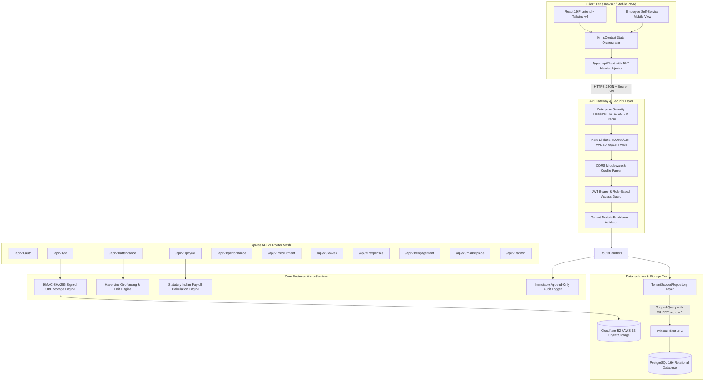
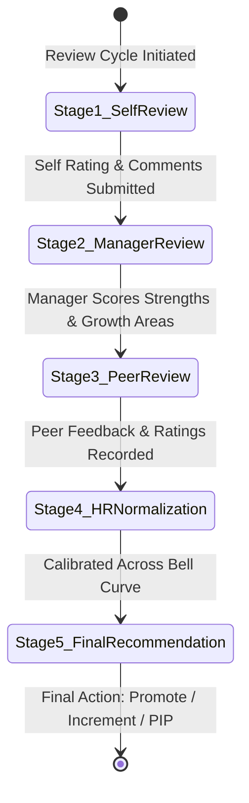

# 📖 Sqbe HRMS — Comprehensive Technical & Architectural Documentation

<div align="center">

**Enterprise Cloud Human Resource Management System**  
*Comprehensive System Reference, Architecture Blueprint, Database Schema, API Specification, and Operational Runbook*

Version: `1.0.0-Enterprise` • Target Engine: `Node.js 22 LTS` • Database: `PostgreSQL 16+` • Frontend: `React 19 / Vite 6`

</div>

---

## 📑 Table of Contents

1. [Executive Architecture Blueprint](#1-executive-architecture-blueprint)
   - [System Topology & High-Level Flow](#system-topology--high-level-flow)
   - [Multi-Tenancy Isolation Architecture](#multi-tenancy-isolation-architecture)
2. [Role-Based Access Control (RBAC) Matrix](#2-role-based-access-control-rbac-matrix)
   - [Hierarchy Tiers & Role Personas](#hierarchy-tiers--role-personas)
   - [Fine-Grained Permissions Matrix](#fine-grained-permissions-matrix)
3. [Deep-Dive Module Specifications](#3-deep-dive-module-specifications)
   - [Module 1: HR Core & Employee Directory](#module-1-hr-core--employee-directory)
   - [Module 2: Attendance, Real-Time Geofencing & Biometrics](#module-2-attendance-real-time-geofencing--biometrics)
   - [Module 3: Payroll, Compensation Engine & Statutory Compliance](#module-3-payroll-compensation-engine--statutory-compliance)
   - [Module 4: Performance Management & OKR 360° Reviews](#module-4-performance-management--okr-360-reviews)
   - [Module 5: Recruitment & Visual ATS Kanban](#module-5-recruitment--visual-ats-kanban)
   - [Module 6: Leave Management & Quota Accruals](#module-6-leave-management--quota-accruals)
   - [Module 7: Employee Self-Service (ESS)](#module-7-employee-self-service-ess)
   - [Module 8: Expense Claims & Reimbursements](#module-8-expense-claims--reimbursements)
   - [Module 9: Employee Engagement & Kudos Recognition](#module-9-employee-engagement--kudos-recognition)
   - [Module 10: Integration Marketplace](#module-10-integration-marketplace)
   - [Module 11: Super Admin Multi-Tenancy Governance](#module-11-super-admin-multi-tenancy-governance)
   - [Module 12: Immutable Audit Logging & Observability](#module-12-immutable-audit-logging--observability)
4. [PostgreSQL Database Schema & Data Models](#4-postgresql-database-schema--data-models)
   - [Model Relationships Overview](#model-relationships-overview)
   - [Entity Specifications (19 Models)](#entity-specifications-19-models)
5. [REST API v1 Comprehensive Specification](#5-rest-api-v1-comprehensive-specification)
   - [Authentication & Session Endpoints](#authentication--session-endpoints)
   - [HR Core Endpoints](#hr-core-endpoints)
   - [Attendance & Geofencing Endpoints](#attendance--geofencing-endpoints)
   - [Payroll & Payslip Endpoints](#payroll--payslip-endpoints)
   - [Leave Management Endpoints](#leave-management-endpoints)
   - [Performance & OKR Endpoints](#performance--okr-endpoints)
   - [Recruitment & ATS Endpoints](#recruitment--ats-endpoints)
   - [Expense Claims Endpoints](#expense-claims-endpoints)
   - [Engagement & Kudos Endpoints](#engagement--kudos-endpoints)
   - [Integration Marketplace Endpoints](#integration-marketplace-endpoints)
   - [File Storage & Signed URL Endpoints](#file-storage--signed-url-endpoints)
   - [Notifications Endpoints](#notifications-endpoints)
   - [Super Admin Endpoints](#super-admin-endpoints)
   - [Tenant Isolation Test Endpoints](#tenant-isolation-test-endpoints)
6. [Security & Cryptography Architecture](#6-security--cryptography-architecture)
   - [Dual-Token JWT Lifecycle](#dual-token-jwt-lifecycle)
   - [HMAC-SHA256 Object Storage Security](#hmac-sha256-object-storage-security)
   - [Rate Limiting & Threat Mitigation](#rate-limiting--threat-mitigation)
7. [Production Deployment & Infrastructure Guide](#7-production-deployment--infrastructure-guide)
   - [Environment Configuration Reference](#environment-configuration-reference)
   - [Docker & Production Build Execution](#docker--production-build-execution)
   - [PostgreSQL Connection Pooling & Health Checks](#postgresql-connection-pooling--health-checks)
8. [Automated Test Suite & Quality Assurance](#8-automated-test-suite--quality-assurance)
   - [Test Suites Breakdown (10 Verification Domains)](#test-suites-breakdown-10-verification-domains)
   - [Running CI/CD Test Validation](#running-cicd-test-validation)
9. [Operational Troubleshooting & FAQs](#9-operational-troubleshooting--faqs)

---

## 1. Executive Architecture Blueprint

### System Topology & High-Level Flow



### Multi-Tenancy Isolation Architecture

Sqbe HRMS is built using a **Shared-Database, Shared-Schema with Strict Application-Layer Tenant Partitioning** pattern:
1. **Foreign Key Anchoring**: Every core table in the database contains an `orgId` column indexed with foreign keys referencing the `organizations` table (`ON DELETE CASCADE`).
2. **Repository Boundary Enforcement**: All database transactions pass through the `TenantScopedRepository` layer located in [server/db/repository.ts](file:///c:/Users/Admin/OneDrive/Desktop/SQBE_HRMS/server/db/repository.ts). The repository automatically appends `orgId: this.tenantOrgId` to all `SELECT`, `INSERT`, `UPDATE`, and `DELETE` queries.
3. **Cross-Tenant Violation Trap**: If any authenticated session attempts to access or mutate an entity whose `orgId` does not match the token's active `orgId` (unless the user holds the `Super Admin` role), the repository raises a `TenantIsolationError (HTTP 403 Forbidden)` and emits a security alert event.
4. **Tenant Isolation Automated Test Suite**: A dedicated test runner verifies cross-tenant boundary protections across all database models in [server/routes/test-tenant.ts](file:///c:/Users/Admin/OneDrive/Desktop/SQBE_HRMS/server/routes/test-tenant.ts).

---

## 2. Role-Based Access Control (RBAC) Matrix

### Hierarchy Tiers & Role Personas

Sqbe HRMS enforces a 10-tier granular access model:

| Role Title | Tier Level | Target Scope | Key Description |
|---|---|---|---|
| **Super Admin** | `Tier 1` | Global Multi-Tenant | Universal system governance, organization provisioning, billing plan upgrades, cross-tenant isolation testing, platform configuration. |
| **Admin** / **Org Admin** | `Tier 2` | Single Tenant (Org-Wide) | Full administrative control over all organization modules, employee lifecycle, compensation structures, shift definitions, payroll execution. |
| **HR Manager** | `Tier 2.1` | Single Tenant (HR Scope) | Full control over employee master, onboarding, department structure, leave quotas, shift assignments, and recruitment. |
| **Payroll Manager** | `Tier 2.2` | Single Tenant (Finance) | Full control over salary structures, statutory tax setups, payroll run execution, payslip generation, and expense reimbursement disbursals. |
| **Manager** | `Tier 3.1` | Department / Direct Reports | Departmental supervisor with authority to approve/reject leave requests, regularize attendance, conduct 360 reviews, and track team OKRs. |
| **Team Lead** | `Tier 3.2` | Project Team / Shift | Sprint-level supervisor with peer review capabilities, shift schedule monitoring, and direct team attendance visibility. |
| **Recruiter** | `Tier 3.3` | Recruitment Scope | Job requisition posting, candidate pipeline progression, interview slot scheduling, and candidate scorecard submission. |
| **Executive** / **Employee** | `Tier 4` | Individual Self-Service | Employee Self-Service (ESS), mobile GPS geofenced clock-in, leave application, expense submission, payslip PDF download, personal OKR updates. |

### Fine-Grained Permissions Matrix

| Feature / Domain | Super Admin | Admin | HR Manager | Payroll Mgr | Manager | Team Lead | Recruiter | Employee |
|---|:---:|:---:|:---:|:---:|:---:|:---:|:---:|:---:|
| **Manage Organizations & Plans** | ✅ | ❌ | ❌ | ❌ | ❌ | ❌ | ❌ | ❌ |
| **Toggle Tenant Modules** | ✅ | ❌ | ❌ | ❌ | ❌ | ❌ | ❌ | ❌ |
| **Create / Terminate Employees** | ✅ | ✅ | ✅ | ❌ | ❌ | ❌ | ❌ | ❌ |
| **View Full Salary / Bank Data** | ✅ | ✅ | ✅ | ✅ | ❌ | ❌ | ❌ | ❌ (Own only) |
| **Execute & Approve Payroll Runs** | ✅ | ✅ | ❌ | ✅ | ❌ | ❌ | ❌ | ❌ |
| **Download PDF Payslips** | ✅ (All) | ✅ (All) | ✅ (All) | ✅ (All) | ❌ (Own only) | ❌ (Own only) | ❌ (Own only) | ✅ (Own only) |
| **Configure Geofences & Policies** | ✅ | ✅ | ✅ | ❌ | ❌ | ❌ | ❌ | ❌ |
| **Punch GPS Attendance** | ✅ | ✅ | ✅ | ✅ | ✅ | ✅ | ✅ | ✅ |
| **Regularize Attendance** | ✅ | ✅ | ✅ | ❌ | ✅ (Directs) | ❌ | ❌ | ❌ (Submit only) |
| **Approve Leave Requests** | ✅ | ✅ | ✅ | ❌ | ✅ (Directs) | ❌ | ❌ | ❌ (Apply only) |
| **360° Review: Manager Stage** | ✅ | ✅ | ✅ | ❌ | ✅ (Directs) | ❌ | ❌ | ❌ |
| **360° Review: Peer Stage** | ✅ | ✅ | ✅ | ❌ | ✅ | ✅ | ❌ | ✅ (Assigned) |
| **Publish Job Postings** | ✅ | ✅ | ✅ | ❌ | ❌ | ❌ | ✅ | ❌ |
| **Move Candidate ATS Stages** | ✅ | ✅ | ✅ | ❌ | ❌ | ❌ | ✅ | ❌ |
| **Submit Expense Claims** | ✅ | ✅ | ✅ | ✅ | ✅ | ✅ | ✅ | ✅ |
| **Approve Expense Claims** | ✅ | ✅ | ✅ | ✅ | ✅ (Directs) | ❌ | ❌ | ❌ |
| **Post Company Announcements** | ✅ | ✅ | ✅ | ❌ | ❌ | ❌ | ❌ | ❌ |
| **Send Peer Kudos Badges** | ✅ | ✅ | ✅ | ✅ | ✅ | ✅ | ✅ | ✅ |
| **Install Marketplace Integrations** | ✅ | ✅ | ❌ | ❌ | ❌ | ❌ | ❌ | ❌ |
| **Access System Audit Logs** | ✅ (Global) | ✅ (Org) | ✅ (HR) | ✅ (Pay) | ❌ | ❌ | ❌ | ❌ |

---

## 3. Deep-Dive Module Specifications

### Module 1: HR Core & Employee Directory

The HR Core module is the central system of record for workforce management.

#### Features & Workflows
1. **Comprehensive Employee Master Profile**:
   - **Personal Information**: Full legal name, date of birth, gender, residential address, personal email, phone number.
   - **Emergency Contacts**: Named contact, relationship, direct phone.
   - **Employment Details**: Unique Employee Code (`EMP-XXX`), Department, Designation, Reporting Manager, Employment Type (`Full-Time`, `Part-Time`, `Contract`, `Intern`), Work Location, Date of Joining, Probation Status.
   - **Compensation & Bank Details**: Annual CTC, Monthly Gross, Bank Name, Masked Account Number (`•••• 4821`), IFSC Code.
   - **Statutory Document Repository**: Uploaded identity documents (`Aadhaar`, `PAN Card`, `Passport`, `Offer Letter`, `Degree Certificate`, `NDA`) with verification badges.
   - **Lifecycle Event Timeline**: Immutable chronological ledger tracking *Onboarding $\rightarrow$ Role Changes $\rightarrow$ Salary Increments $\rightarrow$ Department Transfers $\rightarrow$ Resignations $\rightarrow$ Exits*.
2. **Department & Designation Management**:
   - Department code, department head allocation, real-time employee headcount tally, and annual budget tracking in INR.
   - Designation catalog with level grading (`IC-1` to `DIR-1`) and minimum experience criteria.
3. **Shift Schedules & Work Rules**:
   - Configurable shift start time, end time, grace periods in minutes (e.g. 15 min), break duration (60 min), and active working days (`Monday` to `Friday`).
4. **PapaParse CSV Import / Export**:
   - Full two-way CSV synchronization. Bulk upload hundreds of employee records with schema validation and error feedback.

---

### Module 2: Attendance, Real-Time Geofencing & Biometrics

Provides mathematically verified physical and remote attendance verification.

#### Mathematical Foundation: Haversine Geolocation Algorithm
The backend calculates the exact geodesic surface distance between the employee's GPS coordinates $(\phi_1, \lambda_1)$ and the authorized office geofence $(\phi_2, \lambda_2)$:

$$\Delta \phi = \phi_2 - \phi_1, \quad \Delta \lambda = \lambda_2 - \lambda_1$$
$$a = \sin^2\left(\frac{\Delta \phi}{2}\right) + \cos(\phi_1) \cdot \cos(\phi_2) \cdot \sin^2\left(\frac{\Delta \lambda}{2}\right)$$
$$c = 2 \cdot \text{atan2}\left(\sqrt{a}, \sqrt{1 - a}\right)$$
$$d = R \cdot c \quad (\text{where } R = 6,371,000 \text{ meters})$$

#### Geofence Policies & Anti-Spoofing
- **Perimeter Policies**:
  - `Block`: Strict rejection (HTTP 403) if distance $d > \text{radiusMeters}$.
  - `Allow with Warning`: Allows clock-in but flags record with "Warning Distance" telemetry.
  - `Allow with Approval Required`: Records punch as "Pending Manager Review".
- **Anti-Spoofing & Drift Verification**:
  - Accuracy threshold check: Rejects coordinate payloads if GPS accuracy $> 50\text{m}$.
  - Timestamp latency check: Rejects client timestamps drifting $> 5\text{ minutes}$ from server NTP time.
- **Regularization Workflow**:
  - Employees can submit regularization requests for missed punches with date, time, and explanation. Managers review, approve, or reject requests with automatic attendance log updates.

---

### Module 3: Payroll, Compensation Engine & Statutory Compliance

Automates statutory payroll calculation according to prevailing labour regulations and tax structures.

#### Statutory Compensation Formulae

$$\text{Annual CTC} = \text{Monthly Gross} \times 12$$

**Earnings Breakdown**:
$$\text{Basic Salary} = 40\% \times \text{Monthly Gross}$$
$$\text{House Rent Allowance (HRA)} = 20\% \times \text{Monthly Gross}$$
$$\text{Special Allowance} = 30\% \times \text{Monthly Gross}$$
$$\text{Conveyance Allowance} = \text{₹1,600 (Fixed Standard)}$$
$$\text{Medical Allowance} = \text{₹1,250 (Fixed Standard)}$$

**Statutory Deductions Breakdown**:
$$\text{Provident Fund (PF)} = 12\% \times \text{Basic Salary}$$
$$\text{Employee State Insurance (ESI)} = \begin{cases} 0.75\% \times \text{Monthly Gross} & \text{if Monthly Gross} \le ₹21,000 \\ 0 & \text{if Monthly Gross} > ₹21,000 \end{cases}$$
$$\text{Professional Tax (PT)} = ₹200 \quad (\text{Karnataka / Maharashtra slab standard})$$
$$\text{TDS (Estimated Income Tax)} = 5\% \times \text{Monthly Gross} \quad (\text{Applicable slab estimation})$$
$$\text{Total Deductions} = \text{PF} + \text{ESI} + \text{PT} + \text{TDS}$$
$$\text{Net In-Hand Salary} = \text{Gross Earnings} - \text{Total Deductions} - \text{Loss of Pay (LOP)}$$

#### 5-Step Payroll Execution Lifecycle
1. **Step 1: Cycle Initialization**: Select payroll month/year (e.g. `August 2026`) and active employees.
2. **Step 2: Attendance & Leave Sync**: Synchronize attendance logs, compute Loss of Pay (LOP) days from unauthorized leaves.
3. **Step 3: Statutory Engine Calculation**: Compute Basic, HRA, PF, ESI, PT, and TDS line items for every employee.
4. **Step 4: Audit & Variance Review**: Summary review of Total Gross Pay, Total Statutory Deductions, and Total Net Outflow with variance tracking against the previous month.
5. **Step 5: Approval & Disbursement**: Manager/Admin sign-off, locking the payroll run, and generating downloadable PDF payslips.

---

### Module 4: Performance Management & OKR 360° Reviews

A modern performance evaluation suite integrating Objectives and Key Results (OKRs) with 360° multi-stage reviews.

#### OKR & Goal Framework
- **Goal Categorization**: *Individual*, *Team*, *Departmental*, or *Company-Wide OKR*.
- **Metrics & Weightage**: Target quantifiable metrics, assigned percentage weightage (must sum to 100%), due date milestones, and dynamic progress tracking sliders.

#### 5-Stage 360° Performance Review Workflow


- **Stage 1 (Self Review)**: Employee rates their own performance (1.0 to 5.0) and submits key achievements.
- **Stage 2 (Manager Review)**: Direct manager evaluates deliverables, provides quantitative ratings and qualitative comments.
- **Stage 3 (Peer Review)**: Cross-functional peers provide 360° collaboration feedback.
- **Stage 4 (HR Normalization)**: People Operations normalizes ratings across departments to prevent grade inflation.
- **Stage 5 (Final Action)**: Executive decision: *Promotion*, *Salary Revision*, *Retain & Train*, or *Performance Improvement Plan (PIP)*.

---

### Module 5: Recruitment & Visual ATS Kanban

End-to-end talent acquisition suite from job opening requisitions to onboarding.

#### Visual ATS Hiring Pipeline (7 Stages)
1. **Applied**: Inbound applications via career portals, LinkedIn, and referrals.
2. **Screening**: Resume analysis, initial recruiter pre-screening, and qualification matching.
3. **Technical Round**: In-depth architecture/coding assessments with interviewer scoring.
4. **HR Round**: Behavioral assessment, cultural fit evaluation, compensation expectation alignment.
5. **Offer Extended**: Formal offer letter generation, salary proposal, and background verification.
6. **Hired**: Automated conversion of candidate profile into an active employee record in HR Core.
7. **Rejected**: Automated regret notifications and talent pool archiving.

#### Interview Scheduling & Scorecards
- Schedule interview slots with designated interviewers, duration (e.g. 45 min), and integrated Google Meet / Zoom links.
- Submit structured feedback ratings (1.0 to 5.0) with detailed evaluation notes.

---

### Module 6: Leave Management & Quota Accruals

Statutory time-off administration engine.

- **Leave Quota Types**:
  - `Casual Leave (CL)`: 12 days/year (for personal emergencies).
  - `Earned Leave (EL)`: 15 days/year (accrued monthly, carry-forward eligible).
  - `Sick Leave (SL)`: 10 days/year (medical emergencies with attachment support).
  - `Maternity / Paternity`: Statutory 26 weeks / 2 weeks paid parental leave.
  - `Compensatory Off (Comp Off)`: Credited for weekend or holiday production support.
- **Multi-Tier Approval**: Instant manager notifications with single-click approve/reject actions and leave balance deduction.

---

### Module 7: Employee Self-Service (ESS)

Dedicated portal giving employees autonomy over their workplace data.

- **One-Click Mobile GPS Punch**: Instant clock-in / clock-out with real-time GPS location accuracy indicator.
- **Leave Balance Counters**: Real-time visualization of available vs. consumed leave days.
- **Instant Payslip Downloads**: High-resolution branded PDF payslip downloads.
- **Goal Milestones**: Update personal OKR progress percentages and submit self-reviews.
- **Expense Submissions**: Upload receipts and track reimbursement claim status.

---

### Module 8: Expense Claims & Reimbursements

Reimbursement management for travel, meals, equipment, and medical expenses.

- **Claim Categorization**: *Travel & Conveyance*, *Client Meals*, *Software Subscriptions*, *Office Supplies*, *Medical*.
- **Multi-Stage Approval**: Employee submission $\rightarrow$ Manager verification $\rightarrow$ Finance audit $\rightarrow$ Disbursal via monthly payroll cycle.

---

### Module 9: Employee Engagement & Kudos Recognition

Social workplace tools to foster company culture and celebrate achievements.

- **Company Announcements Feed**: Rich-text announcements with category badges (*Townhall*, *Milestones*, *Policy Updates*, *Celebrations*), pin to top functionality, and peer like counters.
- **Peer-to-Peer Kudos Badges**: Send animated recognition cards featuring badges:
  - 🌟 **Star Performer** (Excellence in delivery)
  - 💡 **Innovation Hero** (Creative problem solving)
  - 🤝 **Team Player** (Exceptional collaboration)
  - 🎯 **Customer Champion** (Client satisfaction)
  - 🛠️ **Helping Hand** (Mentorship and support)
- **Celebration Confetti**: Instant dynamic particle celebration canvas upon awarding kudos.

---

### Module 10: Integration Marketplace

Extend Sqbe HRMS capabilities through pre-integrated third-party platforms.

- **Communication**: Slack (daily attendance bots, leave approval notifications), Microsoft Teams.
- **Productivity**: Jira, GitHub (linking developer activity to OKR milestones), Google Workspace.
- **Finance & ERP**: Zoho Books, Tally, QuickBooks (direct payroll GL journal entry sync).
- **Identity & Hardware**: Biometric fingerprint/facial recognition hardware integration via REST webhooks.

---

### Module 11: Super Admin Multi-Tenancy Governance

Centralized platform management dashboard for SaaS multi-tenancy.

- **Organization Provisioning**: Create new client tenants, configure custom slugs, assign billing tiers (*Enterprise*, *Professional*, *Growth*), and allocate seat counts.
- **Granular Module Toggles**: Enable or disable any of the 10 functional modules per tenant with instant UI feature gating.
- **Cross-Tenant Security Verification**: Live execution of the PostgreSQL tenant isolation test suite directly from the Super Admin dashboard.

---

### Module 12: Immutable Audit Logging & Observability

Security and compliance audit trail.

- **Immutable Append-Only Log**: No user or admin has permissions to `UPDATE` or `DELETE` records in `audit_log_entries`.
- **Event Taxonomy (13+ Critical Events)**: Captures actor ID, actor name, actor role, tenant ID, action type (`USER_LOGIN`, `CREATE_EMPLOYEE`, `SALARY_MODIFICATION`, `EXECUTE_PAYROLL_CALCULATION`, `APPROVE_PAYROLL_RUN`, `GEOFENCE_PUNCH_BLOCKED`, `SUBMIT_LEAVE_REQUEST`), before/after JSON diffs, and client IP addresses.

---

## 4. PostgreSQL Database Schema & Data Models

### Model Relationships Overview

```mermaid
erDiagram
    Organization ||--o{ OrganizationModule : enables
    Organization ||--o{ User : registers
    Organization ||--o{ Employee : employs
    Organization ||--o{ Department : organizes
    Organization ||--o{ Designation : defines
    Organization ||--o{ WorkShift : schedules
    Organization ||--o{ GeofenceLocation : establishes
    Organization ||--o{ AttendanceRecord : tracks
    Organization ||--o{ RegularizationRequest : receives
    Organization ||--o{ LeaveRequest : processes
    Organization ||--o{ SalaryStructure : standardizes
    Organization ||--o{ PayrollRun : executes
    Organization ||--o{ Payslip : generates
    Organization ||--o{ PerformanceGoal : monitors
    Organization ||--o{ PerformanceReview : evaluates
    Organization ||--o{ JobPosting : advertises
    Organization ||--o{ Candidate : evaluates
    Organization ||--o{ Interview : conducts
    Organization ||--o{ ExpenseClaim : reimburses
    Organization ||--o{ EngagementAnnouncement : broadcasts
    Organization ||--o{ EngagementRecognition : awards
    Organization ||--o{ OrganizationMarketplaceApp : installs
    Organization ||--o{ NotificationItem : dispatches
    Organization ||--o{ AuditLogEntry : records
    Organization ||--o{ FileMetadata : stores

    User ||--o{ RefreshToken : issues
    User ||--o{ PasswordResetToken : requests
    User |o--o| Employee : links
    PayrollRun ||--o{ Payslip : contains
    JobPosting ||--o{ Candidate : receives
    Candidate ||--o{ Interview : schedules
    MarketplaceApp ||--o{ OrganizationMarketplaceApp : associates
```



---

### Entity Specifications (19 Models)

#### 1. `Organization` (`organizations`)
| Column | Type | Constraints | Description |
|---|---|---|---|
| `id` | `String (UUID)` | `@id, @default(uuid())` | Primary key |
| `name` | `String` | `NOT NULL` | Legal entity name |
| `slug` | `String` | `@unique, NOT NULL` | Unique URL sub-path identifier |
| `industry` | `String` | `NOT NULL` | Business vertical |
| `employeeCount` | `Int` | `@default(0)` | Total active headcount |
| `activeUsers` | `Int` | `@default(0)` | Active platform users |
| `status` | `Enum (OrganizationStatus)` | `@default(Active)` | `Active`, `Inactive`, `Trial` |
| `joinedDate` | `DateTime` | `@default(now())` | Registration timestamp |
| `contactEmail` | `String` | `NOT NULL` | Billing contact email |
| `billingPlan` | `Enum (BillingPlan)` | `@default(Enterprise)` | `Enterprise`, `Professional`, `Growth` |
| `logoUrl` | `String?` | `NULLABLE` | Brand logo URI |
| `createdAt` | `DateTime` | `@default(now())` | Record creation timestamp |
| `updatedAt` | `DateTime` | `@updatedAt` | Automatic update timestamp |

#### 2. `OrganizationModule` (`organization_modules`)
| Column | Type | Constraints | Description |
|---|---|---|---|
| `id` | `String (UUID)` | `@id, @default(uuid())` | Primary key |
| `orgId` | `String` | `FK -> Organization(id)` | Associated tenant ID |
| `moduleId` | `String` | `NOT NULL` | Module identifier (`hr`, `payroll`, `attendance`, etc.) |
| `enabled` | `Boolean` | `@default(true)` | Feature toggle flag |

#### 3. `User` (`users`)
| Column | Type | Constraints | Description |
|---|---|---|---|
| `id` | `String (UUID)` | `@id, @default(uuid())` | Primary key |
| `orgId` | `String?` | `FK -> Organization(id)` | Tenant ID (`NULL` for Super Admin) |
| `email` | `String` | `@unique, NOT NULL` | Login email address |
| `passwordHash` | `String` | `NOT NULL` | Bcrypt salted password hash |
| `name` | `String` | `NOT NULL` | Full display name |
| `role` | `String` | `NOT NULL` | `Super Admin`, `Admin`, `Manager`, `Employee`, etc. |
| `avatar` | `String?` | `NULLABLE` | Avatar photo URL |
| `department` | `String?` | `NULLABLE` | User department |
| `designation` | `String?` | `NULLABLE` | User job title |
| `employeeId` | `String?` | `@unique, FK -> Employee(id)` | Linked Employee master record |
| `isActive` | `Boolean` | `@default(true)` | Account active status flag |
| `lastLoginAt` | `DateTime?` | `NULLABLE` | Last authenticated timestamp |

#### 4. `RefreshToken` (`refresh_tokens`)
| Column | Type | Constraints | Description |
|---|---|---|---|
| `id` | `String (UUID)` | `@id, @default(uuid())` | Primary key |
| `userId` | `String` | `FK -> User(id)` | User association |
| `tokenHash` | `String` | `@unique, NOT NULL` | SHA-256 / JWT refresh token string |
| `expiresAt` | `DateTime` | `NOT NULL` | Expiration timestamp (7 days) |
| `isRevoked` | `Boolean` | `@default(false)` | Revocation flag |

#### 5. `Employee` (`employees`)
| Column | Type | Constraints | Description |
|---|---|---|---|
| `id` | `String (UUID)` | `@id, @default(uuid())` | Primary key |
| `orgId` | `String` | `FK -> Organization(id)` | Tenant ID |
| `employeeCode` | `String` | `NOT NULL` | Unique employee code (`EMP-101`) |
| `firstName` | `String` | `NOT NULL` | First legal name |
| `lastName` | `String` | `NOT NULL` | Last legal name |
| `avatar` | `String?` | `NULLABLE` | Employee photo URL |
| `email` | `String` | `NOT NULL` | Corporate email |
| `phone` | `String` | `NOT NULL` | Contact telephone number |
| `dob` | `String?` | `NULLABLE` | Date of birth (`YYYY-MM-DD`) |
| `gender` | `String?` | `NULLABLE` | Gender identity |
| `address` | `String?` | `NULLABLE` | Residential address |
| `emergencyContact` | `Json?` | `NULLABLE` | Emergency contact object |
| `department` | `String` | `NOT NULL` | Department name |
| `designation` | `String` | `NOT NULL` | Designation title |
| `managerId` | `String?` | `NULLABLE` | Reporting manager employee ID |
| `managerName` | `String?` | `NULLABLE` | Reporting manager display name |
| `employmentType` | `String` | `@default("Full-Time")` | `Full-Time`, `Contract`, `Intern` |
| `joiningDate` | `String` | `NOT NULL` | Date of joining (`YYYY-MM-DD`) |
| `location` | `String?` | `NULLABLE` | Office work location |
| `status` | `String` | `@default("Active")` | `Active`, `On Leave`, `Notice Period`, `Terminated` |
| `annualCtc` | `Float` | `@default(0.0)` | Annual compensation in INR |
| `monthlyGross` | `Float?` | `NULLABLE` | Computed monthly gross salary |
| `bankDetails` | `Json?` | `NULLABLE` | Bank name, masked account, IFSC code |
| `documents` | `Json?` | `NULLABLE` | Array of verified employee documents |
| `lifecycleHistory` | `Json?` | `NULLABLE` | Array of chronological lifecycle events |
| `shiftId` | `String?` | `FK -> WorkShift(id)` | Assigned shift policy |
| `performanceRating`| `Float?` | `@default(4.0)` | Current performance rating score |

#### 6. `Department` (`departments`)
| Column | Type | Constraints | Description |
|---|---|---|---|
| `id` | `String (UUID)` | `@id, @default(uuid())` | Primary key |
| `orgId` | `String` | `FK -> Organization(id)` | Tenant ID |
| `name` | `String` | `NOT NULL` | Department title (`Engineering`, `HR`, `Finance`) |
| `code` | `String` | `NOT NULL` | Department code (`ENG`, `HR`, `FIN`) |
| `headEmployeeId` | `String?` | `NULLABLE` | Department head employee ID |
| `headName` | `String?` | `NULLABLE` | Department head name |
| `employeeCount` | `Int` | `@default(0)` | Total department headcount |
| `budgetInr` | `Float` | `@default(0.0)` | Allocated annual operating budget |

#### 7. `Designation` (`designations`)
| Column | Type | Constraints | Description |
|---|---|---|---|
| `id` | `String (UUID)` | `@id, @default(uuid())` | Primary key |
| `orgId` | `String` | `FK -> Organization(id)` | Tenant ID |
| `title` | `String` | `NOT NULL` | Job designation title |
| `department` | `String` | `NOT NULL` | Associated department |
| `level` | `String` | `NOT NULL` | Hierarchy level grade (`IC-3`, `M-1`, `DIR-1`) |
| `minExperienceYears` | `Int` | `@default(0)` | Required experience in years |

#### 8. `WorkShift` (`work_shifts`)
| Column | Type | Constraints | Description |
|---|---|---|---|
| `id` | `String (UUID)` | `@id, @default(uuid())` | Primary key |
| `orgId` | `String` | `FK -> Organization(id)` | Tenant ID |
| `name` | `String` | `NOT NULL` | Shift name (`General Shift`, `Night Shift`) |
| `startTime` | `String` | `NOT NULL` | Clock-in time (`09:00`) |
| `endTime` | `String` | `NOT NULL` | Clock-out time (`18:00`) |
| `graceMinutes` | `Int` | `@default(15)` | Permitted late grace period |
| `breakDurationMinutes` | `Int` | `@default(60)` | Standard meal break duration |
| `workingDays` | `Json` | `NOT NULL` | Active working days (`["Monday", "Tuesday", ...]`) |

#### 9. `GeofenceLocation` (`geofence_locations`)
| Column | Type | Constraints | Description |
|---|---|---|---|
| `id` | `String (UUID)` | `@id, @default(uuid())` | Primary key |
| `orgId` | `String` | `FK -> Organization(id)` | Tenant ID |
| `name` | `String` | `NOT NULL` | Office / facility name |
| `address` | `String?` | `NULLABLE` | Physical postal address |
| `latitude` | `Float` | `NOT NULL` | Geodetic latitude (-90 to 90) |
| `longitude` | `Float` | `NOT NULL` | Geodetic longitude (-180 to 180) |
| `radiusMeters` | `Int` | `@default(200)` | Allowed perimeter radius in meters |
| `policy` | `String` | `@default("Allow with Warning")` | `Block`, `Allow with Warning`, `Strict Block` |
| `isRemoteAllowed` | `Boolean` | `@default(true)` | Remote punch permission flag |

#### 10. `AttendanceRecord` (`attendance_records`)
| Column | Type | Constraints | Description |
|---|---|---|---|
| `id` | `String (UUID)` | `@id, @default(uuid())` | Primary key |
| `orgId` | `String` | `FK -> Organization(id)` | Tenant ID |
| `employeeId` | `String` | `NOT NULL` | Employee identifier |
| `employeeName` | `String` | `NOT NULL` | Employee full name |
| `department` | `String` | `NOT NULL` | Department at punch time |
| `date` | `String` | `NOT NULL` | Date of punch (`YYYY-MM-DD`) |
| `clockInTime` | `String?` | `NULLABLE` | Clock-in time (`HH:MM:SS`) |
| `clockOutTime` | `String?` | `NULLABLE` | Clock-out time (`HH:MM:SS`) |
| `workHours` | `Float?` | `@default(0.0)` | Total recorded working hours |
| `status` | `String` | `@default("Present")` | `Present`, `Late`, `Half Day`, `Absent` |
| `geofenceStatus`| `String?` | `NULLABLE` | `In Office Geofence`, `Remote Verified` |
| `withinGeofence`| `Boolean` | `@default(true)` | Physical perimeter boolean |
| `distanceMeters`| `Float?` | `@default(0.0)` | Distance from geofence centroid |
| `punchLocation` | `Json?` | `NULLABLE` | Detailed GPS telemetry payload |

#### 11. `RegularizationRequest` (`regularization_requests`)
| Column | Type | Constraints | Description |
|---|---|---|---|
| `id` | `String (UUID)` | `@id, @default(uuid())` | Primary key |
| `orgId` | `String` | `FK -> Organization(id)` | Tenant ID |
| `employeeId` | `String` | `NOT NULL` | Employee requesting adjustment |
| `employeeName` | `String` | `NOT NULL` | Employee name |
| `date` | `String` | `NOT NULL` | Affected date (`YYYY-MM-DD`) |
| `reason` | `String` | `NOT NULL` | Regularization rationale |
| `requestedClockIn` | `String?` | `NULLABLE` | Corrected clock-in time |
| `requestedClockOut` | `String?` | `NULLABLE` | Corrected clock-out time |
| `status` | `String` | `@default("Pending")` | `Pending`, `Approved`, `Rejected` |
| `approverName` | `String?` | `NULLABLE` | Reviewing manager name |

#### 12. `LeaveRequest` (`leave_requests`)
| Column | Type | Constraints | Description |
|---|---|---|---|
| `id` | `String (UUID)` | `@id, @default(uuid())` | Primary key |
| `orgId` | `String` | `FK -> Organization(id)` | Tenant ID |
| `employeeId` | `String` | `NOT NULL` | Applicant employee ID |
| `employeeName` | `String` | `NOT NULL` | Applicant employee name |
| `department` | `String` | `NOT NULL` | Department |
| `leaveType` | `String` | `NOT NULL` | `Earned Leave (EL)`, `Casual Leave (CL)`, `Sick Leave (SL)` |
| `startDate` | `String` | `NOT NULL` | First day of leave (`YYYY-MM-DD`) |
| `endDate` | `String` | `NOT NULL` | Last day of leave (`YYYY-MM-DD`) |
| `days` | `Float` | `@default(1.0)` | Total leave days |
| `reason` | `String` | `NOT NULL` | Time-off explanation |
| `status` | `String` | `@default("Pending")` | `Pending`, `Approved`, `Rejected` |
| `approverName` | `String?` | `NULLABLE` | Approving manager name |

#### 13. `SalaryStructure` (`salary_structures`)
| Column | Type | Constraints | Description |
|---|---|---|---|
| `id` | `String (UUID)` | `@id, @default(uuid())` | Primary key |
| `orgId` | `String` | `FK -> Organization(id)` | Tenant ID |
| `name` | `String` | `NOT NULL` | Structure title |
| `basicPercentage` | `Float` | `@default(40.0)` | Basic pay percentage |
| `hraPercentage` | `Float` | `@default(20.0)` | HRA percentage |
| `specialAllowancePercentage` | `Float` | `@default(30.0)` | Special allowance percentage |
| `conveyanceFixed` | `Float` | `@default(1600.0)` | Fixed conveyance in INR |
| `medicalAllowanceFixed` | `Float` | `@default(1250.0)` | Fixed medical allowance in INR |
| `pfRate` | `Float` | `@default(12.0)` | Provident fund rate (%) |
| `esiRate` | `Float` | `@default(0.75)` | ESI employee deduction rate (%) |
| `professionalTaxFixed` | `Float` | `@default(200.0)` | Fixed Professional Tax in INR |
| `isDefault` | `Boolean` | `@default(true)` | Default structure flag |

#### 14. `PayrollRun` (`payroll_runs`)
| Column | Type | Constraints | Description |
|---|---|---|---|
| `id` | `String (UUID)` | `@id, @default(uuid())` | Primary key |
| `orgId` | `String` | `FK -> Organization(id)` | Tenant ID |
| `monthYear` | `String` | `NOT NULL` | Payroll period (`2026-08`) |
| `status` | `String` | `@default("Draft")` | `Draft`, `Calculated`, `Approved`, `Disbursed` |
| `totalEmployees` | `Int` | `@default(0)` | Employees in run |
| `totalGrossPay` | `Float` | `@default(0.0)` | Total gross payout |
| `totalDeductions`| `Float` | `@default(0.0)` | Total statutory deductions |
| `totalNetPay` | `Float` | `@default(0.0)` | Net disbursed amount |
| `approvedBy` | `String?` | `NULLABLE` | Approving officer |

#### 15. `Payslip` (`payslips`)
| Column | Type | Constraints | Description |
|---|---|---|---|
| `id` | `String (UUID)` | `@id, @default(uuid())` | Primary key |
| `payrollRunId` | `String` | `FK -> PayrollRun(id)` | Associated payroll run |
| `orgId` | `String` | `FK -> Organization(id)` | Tenant ID |
| `employeeId` | `String` | `NOT NULL` | Employee ID |
| `employeeName` | `String` | `NOT NULL` | Employee full name |
| `employeeCode` | `String` | `NOT NULL` | Employee code |
| `monthYear` | `String` | `NOT NULL` | Payslip cycle |
| `workingDays` | `Int` | `@default(30)` | Total calendar working days |
| `daysPresent` | `Int` | `@default(28)` | Days present |
| `paidLeaves` | `Int` | `@default(2)` | Paid leaves taken |
| `lossOfPayDays` | `Int` | `@default(0)` | Unpaid LOP days |
| `basicSalary` | `Float` | `@default(0.0)` | Computed basic earnings |
| `hra` | `Float` | `@default(0.0)` | Computed HRA earnings |
| `specialAllowance` | `Float` | `@default(0.0)` | Special allowances |
| `grossEarnings` | `Float` | `@default(0.0)` | Total gross earnings |
| `providentFund` | `Float` | `@default(0.0)` | Deducted PF |
| `esi` | `Float` | `@default(0.0)` | Deducted ESI |
| `professionalTax` | `Float` | `@default(0.0)` | Deducted PT |
| `tdsIncomeTax` | `Float` | `@default(0.0)` | Deducted TDS |
| `totalDeductions` | `Float` | `@default(0.0)` | Total deductions |
| `netSalary` | `Float` | `@default(0.0)` | Net payable salary |
| `pdfFileKey` | `String?` | `NULLABLE` | S3 / R2 stored PDF file key |

#### 16. `PerformanceGoal` (`performance_goals`)
| Column | Type | Constraints | Description |
|---|---|---|---|
| `id` | `String (UUID)` | `@id, @default(uuid())` | Primary key |
| `orgId` | `String` | `FK -> Organization(id)` | Tenant ID |
| `employeeId` | `String?` | `NULLABLE` | Assigned employee |
| `title` | `String` | `NOT NULL` | Goal / OKR title |
| `category` | `String` | `@default("OKR")` | `OKR`, `Individual`, `Team` |
| `targetMetric` | `String` | `NOT NULL` | Target metric deliverable |
| `currentProgress`| `Float` | `@default(0.0)` | Progress percentage (0 - 100%) |
| `weightage` | `Float` | `@default(25.0)` | Goal weightage (%) |
| `dueDate` | `String` | `NOT NULL` | Due date (`YYYY-MM-DD`) |
| `status` | `String` | `@default("On Track")`| `On Track`, `At Risk`, `Completed` |

#### 17. `JobPosting` (`job_postings`) & `Candidate` (`candidates`)
- `JobPosting`: Tracks recruitment requisitions with job title, department, location, compensation range, openings, and status (`Draft`, `Published`, `Closed`).
- `Candidate`: Manages candidate profiles, resumes, ratings, expected CTC, notice period, and active hiring stages (*Applied*, *Screening*, *Technical*, *HR*, *Offer*, *Hired*, *Rejected*).

#### 18. `ExpenseClaim` (`expense_claims`)
- Tracks reimbursement claims with category (`Travel`, `Meals`, `Software`, `Medical`), amount in INR, merchant name, receipt file keys, and approval status (`Pending`, `Approved`, `Rejected`, `Reimbursed`).

#### 19. `AuditLogEntry` (`audit_log_entries`)
- Immutable security log table capturing `timestamp`, `userId`, `userName`, `userRole`, `action`, `module`, `recordName`, `previousValue`, `newValue`, and client `ipAddress`.

---

## 5. REST API v1 Comprehensive Specification

All endpoints are versioned under `/api/v1` and return standardized JSON responses:

```typescript
interface ApiResponse<T> {
  success: boolean;
  data: T;
  meta?: { total?: number; page?: number; pageSize?: number };
  error?: { code: string; message: string; details?: any };
}
```

### Authentication & Session Endpoints

#### `POST /api/v1/auth/login`
- **Description**: Authenticates user credentials and issues a short-lived JWT access token along with a secure `HttpOnly` refresh token cookie.
- **Rate Limit**: 30 requests per 15 minutes per IP.
- **Request Body**:
  ```json
  {
    "email": "priya.sharma@sqbehrms.com",
    "password": "demo123"
  }
  ```
- **Response `200 OK`**:
  ```json
  {
    "success": true,
    "data": {
      "accessToken": "eyJhbGciOiJIUzI1NiIsInR5cCI6IkpXVCJ9...",
      "user": {
        "id": "usr-admin-priya",
        "email": "priya.sharma@sqbehrms.com",
        "name": "Priya Sharma",
        "role": "Admin",
        "orgId": "org-acro",
        "employeeId": "emp-acro-101"
      }
    }
  }
  ```

#### `POST /api/v1/auth/refresh-token`
- **Description**: Rotates and reissues an access token using the `refreshToken` cookie.
- **Response `200 OK`**: Returns new `accessToken`.

#### `GET /api/v1/auth/me`
- **Description**: Returns the authenticated user's profile and tenant configuration.
- **Headers**: `Authorization: Bearer <token>`

---

### HR Core Endpoints

#### `GET /api/v1/hr/employees`
- **Query Params**: `department`, `designation`, `status`, `search`, `page`, `pageSize`.
- **Response `200 OK`**: Returns array of employee master records within tenant.

#### `POST /api/v1/hr/employees`
- **Role Required**: `Admin`, `Super Admin`, `HR Manager`.
- **Request Body**: Validates employee creation schema (personal info, salary, department).

#### `PUT /api/v1/hr/employees/:id`
- **Role Required**: `Admin`, `Super Admin`, `HR Manager`.
- **Description**: Updates employee profile and appends lifecycle event if designation or salary changes.

#### `POST /api/v1/hr/employees/bulk-import`
- **Description**: Bulk inserts/updates employees via JSON array parsed from CSV.

---

### Attendance & Geofencing Endpoints

#### `POST /api/v1/attendance/clock-in`
- **Description**: Executes server-side Haversine geofence calculation against employee GPS coordinates.
- **Request Body**:
  ```json
  {
    "latitude": 12.9279,
    "longitude": 77.6271,
    "accuracyMeters": 10.5,
    "deviceInfo": "Mozilla/5.0 Mobile PWA"
  }
  ```
- **Response `200 OK`**:
  ```json
  {
    "success": true,
    "data": {
      "record": {
        "id": "att-emp-104-2026-09-02",
        "date": "2026-09-02",
        "clockInTime": "09:05:12",
        "status": "Present",
        "withinGeofence": true,
        "distanceMeters": 18.4
      }
    }
  }
  ```

#### `POST /api/v1/attendance/clock-out`
- **Description**: Records clock-out timestamp and computes total working duration hours.

#### `POST /api/v1/attendance/regularize`
- **Description**: Submits an attendance regularization request for missing or failed punches.

---

### Payroll & Payslip Endpoints

#### `GET /api/v1/payroll/runs`
- **Description**: Lists all monthly payroll cycles for the organization.

#### `POST /api/v1/payroll/runs/calculate`
- **Role Required**: `Admin`, `Super Admin`, `Payroll Manager`.
- **Request Body**:
  ```json
  {
    "monthYear": "2026-08"
  }
  ```
- **Description**: Executes statutory calculation across all active employees in the organization and creates payslip draft records.

#### `POST /api/v1/payroll/runs/:id/approve`
- **Role Required**: `Admin`, `Super Admin`, `Payroll Manager`.
- **Description**: Formally approves and locks the payroll run, transitioning status to `Approved`.

#### `GET /api/v1/payroll/payslips/:id`
- **Description**: Retrieves single payslip record. Regular employees may only access their own payslips (RBAC enforced).

---

### Performance & OKR Endpoints

#### `GET /api/v1/performance/goals`
- **Description**: Retrieves OKRs and performance goals within the tenant.

#### `PATCH /api/v1/performance/goals/:id/progress`
- **Description**: Updates progress percentage (0 - 100%) and auto-completes goals reaching 100%.

#### `POST /api/v1/performance/reviews/:id/stage`
- **Description**: Progresses a 360° review to the next evaluation stage (*Self $\rightarrow$ Manager $\rightarrow$ Peer $\rightarrow$ HR $\rightarrow$ Final*).

---

### Recruitment & ATS Endpoints

#### `GET /api/v1/recruitment/jobs`
- **Description**: Returns all published and draft job requisitions.

#### `PATCH /api/v1/recruitment/candidates/:id/stage`
- **Description**: Advances candidate across the visual Kanban hiring pipeline stages.

#### `POST /api/v1/recruitment/interviews`
- **Description**: Schedules interview slot with candidate, interviewer, duration, and meeting link.

---

### File Storage & Signed URL Endpoints

#### `POST /api/v1/files/signed-upload-url`
- **Description**: Generates an HMAC-SHA256 cryptographically signed S3/R2 upload URL.
- **Request Body**:
  ```json
  {
    "fileName": "resume_sneha.pdf",
    "mimeType": "application/pdf",
    "category": "resume"
  }
  ```

#### `GET /api/v1/files/signed-download-url`
- **Description**: Validates signature and returns temporary signed download link for protected documents.

---

### Super Admin Endpoints

#### `GET /api/v1/admin/organizations`
- **Role Required**: `Super Admin`.
- **Description**: Returns master list of all enterprise tenants across the global platform.

#### `PATCH /api/v1/admin/organizations/:id/modules`
- **Role Required**: `Super Admin`.
- **Request Body**:
  ```json
  {
    "moduleId": "payroll",
    "enabled": false
  }
  ```
- **Description**: Instantly enables or disables a functional module for a specific tenant.

---

### Tenant Isolation Test Endpoints

#### `POST /api/v1/test-tenant-isolation/run`
- **Role Required**: `Super Admin` or test automation runner.
- **Description**: Executes live cross-tenant database read, write, and deletion boundary checks in PostgreSQL, returning a full diagnostic test pass/fail report.

---

## 6. Security & Cryptography Architecture

### Dual-Token JWT Lifecycle

1. **Access Token**:
   - Encoded with `userId`, `orgId`, `role`, `name`, `email`, `employeeId`.
   - Signed using `HS256` HMAC with `JWT_SECRET`.
   - Short TTL: **15 minutes** to minimize impact of compromised tokens.
2. **Refresh Token**:
   - Cryptographically separated from access token secret using `JWT_REFRESH_SECRET`.
   - Persisted in PostgreSQL `refresh_tokens` table with hash and expiration.
   - Delivered to browser via `HttpOnly`, `Secure`, `SameSite=Strict` cookie (`refreshToken`), protecting against XSS token exfiltration.
   - Automatic token rotation: Token is invalidated and re-issued upon each refresh request.

### HMAC-SHA256 Object Storage Security

Sqbe HRMS protects sensitive files (payslips, government IDs, resumes) using time-bounded cryptographic signatures:

$$\text{Signature Payload} = \text{fileKey} + \text{":"} + \text{orgId} + \text{":"} + \text{action} + \text{":"} + \text{expiresTimestamp}$$
$$\text{Signature} = \text{HMAC-SHA256}(\text{STORAGE\_SECRET\_KEY}, \text{Signature Payload})$$

- Any attempt to tamper with the `orgId`, `fileKey`, or expiration timestamp causes instant signature validation failure (`HTTP 403 INVALID_SIGNATURE`).
- Path traversal sequences (e.g. `../../etc/passwd`) are strictly blocked by filename sanitization regex:
  ```typescript
  const isSafeKey = /^[a-zA-Z0-9_-]+(\.[a-zA-Z0-9]+)?$/.test(fileKey);
  ```

### Rate Limiting & Threat Mitigation

- **Global API Limiter**: 500 requests per 15 minutes per IP.
- **Auth Endpoint Limiter**: 30 login/reset attempts per 15 minutes per IP to prevent brute-force credential stuffing.
- **Security Headers Injected**:
  ```http
  X-Content-Type-Options: nosniff
  X-Frame-Options: DENY
  X-XSS-Protection: 1; mode=block
  Referrer-Policy: strict-origin-when-cross-origin
  Strict-Transport-Security: max-age=31536000; includeSubDomains; preload
  ```

---

## 7. Production Deployment & Infrastructure Guide

### Environment Configuration Reference

| Variable Name | Required | Default | Description |
|---|:---:|---|---|
| `PORT` | Optional | `3000` | HTTP listening port |
| `NODE_ENV` | Required | `development` | Environment mode (`development` or `production`) |
| `CORS_ORIGIN` | Required | `http://localhost:3000` | Allowed CORS origin URL |
| `DATABASE_URL` | **Required** | — | PostgreSQL connection string |
| `JWT_SECRET` | **Required** | — | Secret key for Access Token HMAC signing |
| `JWT_REFRESH_SECRET`| **Required** | — | Secret key for Refresh Token HMAC signing |
| `JWT_EXPIRES_IN` | Optional | `15m` | Access token lifespan |
| `JWT_REFRESH_EXPIRES_IN` | Optional | `7d` | Refresh token lifespan |
| `STORAGE_ENDPOINT` | Optional | — | Cloudflare R2 / AWS S3 S3-compatible endpoint |
| `STORAGE_BUCKET` | Optional | `sqbe-hrms-documents` | S3 bucket name |
| `STORAGE_KEY_ID` | Optional | — | Object storage access key ID |
| `STORAGE_SECRET_KEY`| Optional | — | Object storage secret access key |

---

### Docker & Production Build Execution

#### 1. Compile Assets & Server Bundle
```bash
# Builds Vite frontend into dist/ and bundles server.ts into dist/server.cjs
npm run build
```

#### 2. Start Production Service
```bash
npm run start
```

#### 3. Containerization Dockerfile Example
```dockerfile
FROM node:22-alpine AS builder
WORKDIR /app
COPY package*.json ./
RUN npm ci
COPY . .
RUN npx prisma generate
RUN npm run build

FROM node:22-alpine AS runner
WORKDIR /app
ENV NODE_ENV=production
COPY package*.json ./
RUN npm ci --only=production
COPY --from=builder /app/dist ./dist
COPY --from=builder /app/prisma ./prisma
COPY --from=builder /app/node_modules/.prisma ./node_modules/.prisma
EXPOSE 3000
CMD ["node", "dist/server.cjs"]
```

---

## 8. Automated Test Suite & Quality Assurance

Sqbe HRMS features an automated test harness located in [server/tests/runAllTests.ts](file:///c:/Users/Admin/OneDrive/Desktop/SQBE_HRMS/server/tests/runAllTests.ts).

```bash
npm test
```

### Test Suites Breakdown (10 Verification Domains)

1. **Authentication Security**:
   - Bcrypt round-trip verification & incorrect password rejection.
   - JWT access token generation and claim payload decoding.
   - Rejection of expired tokens (`TokenExpiredError`).
   - Rejection of tampered signatures (`JsonWebTokenError`).
   - Cryptographic key isolation between Access and Refresh tokens.
2. **Authorization & RBAC**:
   - Super Admin universal platform mutation privileges.
   - Rejection of employee attempts to trigger payroll or organization changes.
   - Manager permission boundaries (approval allowed, restructuring forbidden).
3. **Multi-Tenant Isolation**:
   - Tenant query boundary enforcement (`WHERE orgId = ?`).
   - Cross-tenant ID query rejection (`TenantIsolationError 403`).
   - Cross-tenant update rejection.
4. **Attendance & Geofencing**:
   - Exact coordinate Haversine distance accuracy ($0\text{m}$).
   - Within-perimeter validation ($\le 200\text{m}$).
   - Outside-perimeter rejection ($\approx 8\text{km}$) with `Block` policy.
   - Out-of-bounds latitude/longitude validation ($[-90, 90], [-180, 180]$).
   - Accurate shift duration computation.
5. **Payroll Calculation & Security**:
   - Basic Pay ($40\%$) and Provident Fund ($12\%$) mathematical precision.
   - Net in-hand salary deduction equation consistency.
   - Payslip record access isolation per employee ID.
6. **File Storage & Signed URLs**:
   - HMAC-SHA256 signature generation and verification.
   - Tampered tenant parameter rejection.
   - Expired signature rejection.
   - Path traversal attempt blocking (`../../etc/passwd`).
7. **Leave Workflows**:
   - State transition validation (*Pending $\rightarrow$ Approved / Rejected*).
8. **Performance & OKR Workflows**:
   - Progress percentage completion triggers.
   - 5-stage review stage advancement.
9. **Recruitment & ATS Workflows**:
   - Candidate Kanban stage advancement through 7 stages.
   - Interview scheduling and scorecard submission.
10. **Audit Logging**:
    - Generator verification across all 13 critical lifecycle events.

---

## 9. Operational Troubleshooting & FAQs

### Q1: Database connection failure (`PrismaClientInitializationError`)
- **Cause**: PostgreSQL is not reachable at the connection URI in `.env`.
- **Solution**: Verify PostgreSQL is running (`sudo systemctl status postgresql` or Docker container) and verify credentials in `DATABASE_URL`. Run `npm run db:generate` followed by `npm run db:push`.

### Q2: Cross-Tenant 403 Forbidden Errors
- **Cause**: User session attempted to access a record belonging to another `orgId`.
- **Solution**: Confirm that the user's active tenant token matches the entity being queried. Use the Super Admin persona (`superadmin@sqbehrms.com`) for cross-tenant operations.

### Q3: Geofenced Clock-In Blocked (`GEOFENCE_PUNCH_BLOCKED`)
- **Cause**: The client's GPS coordinates are outside the authorized geofence radius.
- **Solution**: In the Attendance module settings, verify the geofence latitude/longitude and radius (meters), or change the policy from `Block` to `Allow with Warning` for remote testing.

### Q4: How do I seed clean demo data?
- **Solution**: Run `npm run db:seed`. This resets and populates all default organizations, departments, employees, and user personas with `demo123` passwords.

---

<div align="center">

**Sqbe HRMS — Next-Generation Enterprise Workforce Operating System**  
*Engineered with precision for global enterprise scale.*

</div>
